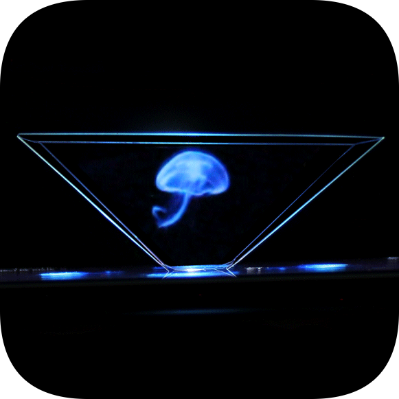

  

<h1 align="center">
  Holography-Chat
</h1>

## Holography-Chat &middot;      ##

This repository contains the code for the client and server side of the `Holography-Chat` project.

The client part allows you to broadcast a video stream from a video camera / screen (even when this application is minimized) of an `Android` device to a remote `Android` device with a server part of the software.
The client part of the software uses the `OpenCV` library, in particular the `Sobel Filter`. It also provides the ability to clear the background behind a person (implemented algorithmically - without the use of neural networks and machine learning).

The server part of the software receives a video stream from the client part and displays it as four images rotated relative to each other at an angle of 90 degrees. This arrangement of images makes it possible to represent the received video stream in the form of a hologram by using an inverted truncated glass/plastic pyramid located in the center of the screen of the `Android` device.

**:clapper: Example using (GIF):** 

This animation demonstrates scenarios for using the `Holography-Chat`. 

  

### :bookmark_tabs: Licence ###
Holography Chat is [CC BY-NC-SA 3.0 licensed](./LICENSE).
